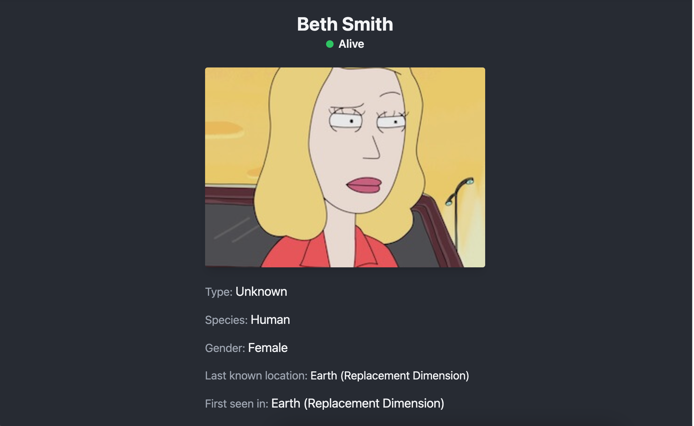

# Rick and Morty (React + TS + React Query + Zustand)

React, Tailwind CSS, React Query, Zustand, TypeScript를 사용하여 개발된 웹 애플리케이션입니다. 이 애플리케이션은 Rick and Morty API를 사용하여 캐릭터 목록을 표시하고, 상세 정보를 제공합니다. 페이지네이션 기능을 통해 캐릭터 목록을 쉽게 탐색할 수 있습니다.

- [DEMO](https://main.d2eiyf73jl02ei.amplifyapp.com/)




## 주요 기능

- 캐릭터 목록 보기: Rick and Morty의 모든 캐릭터를 목록 형식으로 볼 수 있습니다.
- 캐릭터 상세 정보: 각 캐릭터를 클릭하여 상세 정보를 볼 수 있습니다.
- 페이지네이션: 이전/다음 버튼 및 페이지 번호를 통해 캐릭터 목록을 탐색할 수 있습니다.
- 다크 모드: 다크 모드와 라이트 모드를 전환할 수 있습니다.

## 설치 및 실행 방법

1. 저장소를 클론합니다.

```bash
git clone https://github.com/fromnowwon/react-rick-and-morty
```

2. 프로젝트 폴더로 이동합니다.

```bash
cd react-rick-and-morty
```

3. 필요한 패키지를 설치합니다.

```bash
npm install
```

4. 개발 서버를 실행합니다.

```bash
npm run dev
```

5. 웹 브라우저에서 `http://localhost:3000`을 엽니다.

## 사용 기술

- **프론트엔드:** React.js, TypeScript
- **서버 상태 관리**: React Query
- **클라이언트 상태 관리**: Zustand
- **UI 프레임워크**: Tailwind CSS, Framer Motion(애니메이션), Shadcn UI(스켈레톤 UI)
- **배포:** AWS Amplify
- **API:** [Rick and Morty API](https://rickandmortyapi.com/)

## 폴더 및 파일 구조

```plaintext
react-rick-and-morty/
├── public/
├── src/
│   ├── components/
│   │   ├── ui/
│   │   ├── CharacterCard.tsx
│   │   ├── CharacterList.tsx
│   │   ├── DarkModeSwitch.tsx
│   │   ├── MotionDiv.tsx
│   │   ├── NavBar.tsx
│   │   └── Pagination.tsx
│   ├── hooks/
│   │   ├── useCharacters.ts
│   ├── lib/
│   │   ├── api.ts
│   │   ├── utils.ts
│   ├── pages/
│   │   ├── CharacterDetail.ts
│   │   ├── Home.ts
│   ├── store/
│   │   ├── useCharacterStore.ts
│   ├── types/
│   │   ├── CharacterTypes.ts
│   ├── App.tsx
│   ├── main.tsx
│   ├── index.css
├── .gitignore
├── package.json
├── tailwind.config.js
├── tsconfig.json
├── vite.config.ts
└── ...
```

- **components/**: React 컴포넌트 파일
  - **ui/**: Shadcn UI 컴포넌트
- **hooks/**: 커스텀 훅
- **lib**: api, 재사용 함수 등 라이브러리
- **pages**: 페이지 컴포넌트
- **store**: 상태 관리
- **types**: 타입 정의 파일

## 저자

- [Chaewon Jeong](https://github.com/fromnowwon)

## 라이센스

이 프로젝트는 MIT 라이센스 하에 배포됩니다. 자세한 내용은 LICENSE 파일을 참조하세요.

```

위 README.md 예시는 프로젝트의 구조, 설치 및 실행 방법, 주요 기능, 기여 방법, 저자 정보, 라이센스 등을 포함하고 있습니다. 프로젝트의 특성에 맞게 세부적으로 수정하여 사용하시면 됩니다.
```
